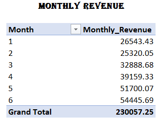
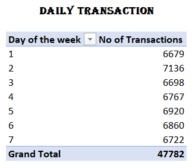
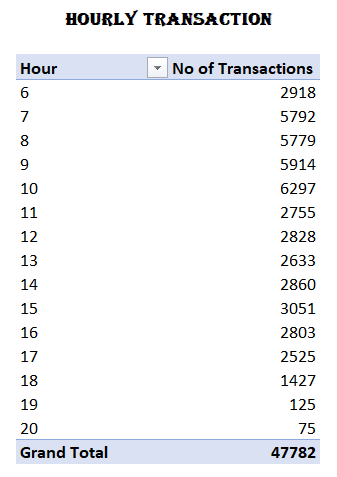
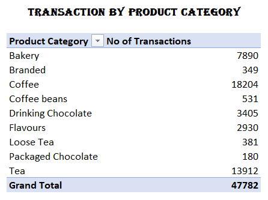
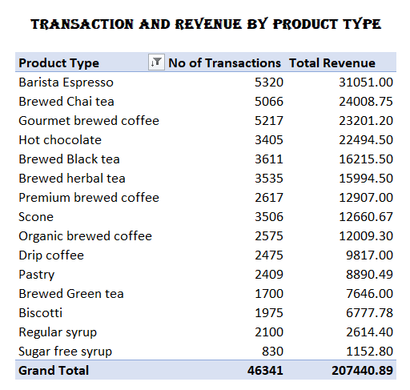

# Coffee_Shop_Sales_Analysis

## Introduction

This project involves analyzing transaction records from a fictitious coffee shop in New York City. The goal is to prepare the data for analysis, explore it using PivotTables, and create an interactive dashboard to gain insights and make strategic recommendations for improving the coffee shop's operations.

The key steps of this analysis involves:

- Data Preparation: Cleaning, manipulate and prepare the dataset for further analysis (e.g: creating calculated fields)
- Data Exploration: Creating PivotTables to explore time series and product-level trends 
- Dashboard Creation: Build an interactive dashboard with Pivot Charts to visualize the data, identify key insights and provide strategic recommendations

## Analysis

**1. Data Preparation and Exploration:** 
     - The dataset contains around 149,116 transactions recorded over a period of 6 months from January 2023 to June 2023 in 3 different stores of a fictious coffee shop in New York
     - Each record includes multiple details regarding the transaction including date, time, quantity, store details, product information and unit price
     - A new field "Revenuw" was calculated as (Unit Price * transaction_qty)
     - Further, Month, Day of the week and Hour of the transaction were extracted from the "transaction_date" and "transaction_time" fields using the "MONTH()", "WEEKDAY()" AND "HOUR()" functions respectively
     
**2. Data Exploration with Pivot Tables:**
     The next step in the analysis was to slice and dice the coffee shop data using Pivot Tables and create views to analyze the below time-series and product-level trends

     **- Revenue by Month:** A PivotTable showing revenue over different months

         

     **- Transactions by Day of the week and Hour:** PivotTables displaying the number of transactions for each day of the week and each hour of the day

         

         
 
     **- Transactions by Product Category:** A PivotTable showing the number of transactions per product category, sorted in descending order

         

     **- Top 15 Product Types:** A PivotTable displaying the number of transactions and revenue for the top 15 product types, sorted and filtered by the number of transactions

         
     
## Key Insights

