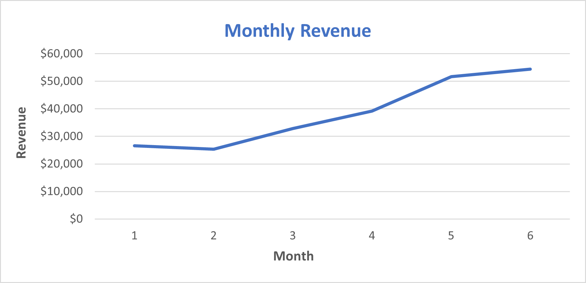
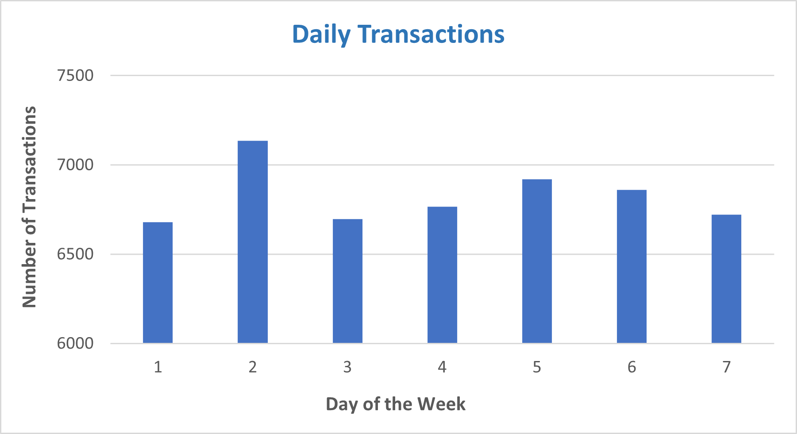
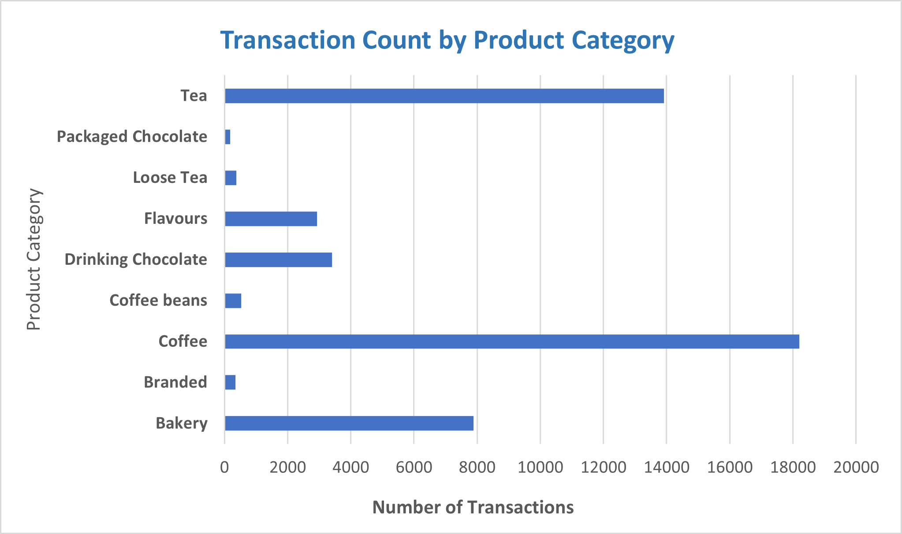
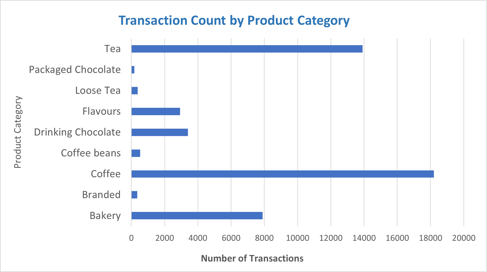

# Coffee Shop Sales Analysis

## Introduction

This project involves analyzing transaction records from a fictitious coffee shop in New York City. The goal is to prepare the data for analysis, explore it using PivotTables, and create an interactive dashboard to gain insights and make strategic recommendations for improving the coffee shop's operations.

The key steps of this analysis involves:

- Data Preparation: Cleaning, manipulate and prepare the dataset for further analysis (e.g: creating calculated fields)
- Data Exploration: Creating PivotTables to explore time series and product-level trends 
- Dashboard Creation: Build an interactive dashboard with Pivot Charts to visualize the data, identify key insights and provide strategic recommendations

## Analysis

**1. Data Preparation and Exploration:** 
     - The dataset contains around 149,116 transactions recorded over a period of 6 months from January 2023 to June 2023 in 3 different stores of a fictious coffee shop in New York
     - Each record includes multiple details regarding the transaction including date, time, quantity, store details, product information and unit price
     - A new field "Revenuw" was calculated as (Unit Price * transaction_qty)
     - Further, Month, Day of the week and Hour of the transaction were extracted from the "transaction_date" and "transaction_time" fields using the "MONTH()", "WEEKDAY()" AND "HOUR()" functions respectively
     
**2. Data Exploration and Visualization with Pivot Tables and Pivot Charts:**
     The next step in the analysis was to slice and dice the coffee shop data using Pivot Tables and create views to analyze the below time-series and product-level trends

 **Revenue by Month:** A PivotTable showing revenue over different months visualized using a line chart option in the Pivot Charts
 
              

 **Transactions by Day of the week and Hour:** PivotTables displaying the number of transactions for each day of the week and each hour of the day

                

                
 
 **Transactions by Product Category:** A PivotTable showing the number of transactions per product category, sorted in descending order

   

 **Top 15 Product Types:** A PivotTable displaying the number of transactions and revenue for the top 15 product types, sorted and filtered by the number of transactions
  
               

Following their creation, the Pivot Tables and Pivot Charts were assembled in the dashboard layout and format & alignment was adjusted. A slicer for store location was added to facilitate the analysis for different stores.  

## Key Insights

Using the data explored through PivotTables and visualizations, several key patterns and trends that can inform strategic decisions for the coffee shop were identified:

**Peak Hours:** The morning hours from 7 to 10 AM consistently emerged as the peak hours for transactions across all three store locations. This is likely due to 
  customers purchasing purchasing breakfast items and morning coffee before heading to work or school and Increased demand for caffeine and quick meals during 
  morning commutes.

**Peak Days:** While the overall peak day for transactions is Thursday, the peak day varies by location
    - Lower Manhattan: Sunday, possibly due to weekend outings and leisure activities in a busy area
    - Astoria: Thursday, potentially linked to local events or shopping habits in the community
    - Hell's Kitchen: Friday, 

**Revenue by Month:** Across all stores, highest revenue has been generated in June, while February sees the lowest revenue consistently. Possible reasons for 
   this trend could be
    - June: Warmer weather leading to increased foot traffic and sales, as well as possible seasonal promotions and tourism
    - February: Colder weather and post-holiday spending lulls could result in fewer customers and lower sales

**Popular Product Categories:** Coffee and Tea are the most popular product categories, driving the highest number of transactions

**Top-Selling Product Types:** Within these categories, specific products such as "Barista Espresso", "Gourmet brewed coffee" and "Brewed Chai tea" have been consistently rank as top sellers

## Strategic Recommendations

Based on the above insights, implementing these strategies will optimize operations, drive sales during peak times, and enhance overall customer satisfaction across all store locations:

**Peak Hours Strategy:**
   - Increase morning staffing and prioritize breakfast items and coffee supplies from 7 to 10 AM
   - Consider promotions on popular morning items to attract commuters

**Peak Days Strategy:**
   - Tailor marketing efforts by location based on peak days (Sunday in Lower Manhattan, Thursday in Astoria, Friday in Hell's Kitchen)
   - Plan special events or promotions on these days to boost sales

**Revenue by Month Strategy:**
   - Use seasonal promotions to capitalize on high-revenue months like June
   - Implement winter-themed promotions in low-revenue months like February
     
**Popular Product Categories Strategy:**
   - Ensure consistent availability and quality of Coffee and Tea products
   - Expand variety within these categories to cater to diverse tastes

**Top-Selling Product Types Strategy:**
   - Feature top sellers prominently in menus and promotions
   - Train staff to upsell complementary items to increase average transaction value

**Overall Operational Recommendations:**
   - Invest in customer service training to handle peak periods effectively
   - Use real-time data to make informed operational decisions and adapt strategies

## Conclusion

This project highlights the importance of data-driven decision-making in optimizing the operations of a coffee shop. By leveraging data preparation, exploration, and visualization techniques in the "Excel" tool, we can uncover valuable insights and make strategic recommendations to enhance the overall business performance.
